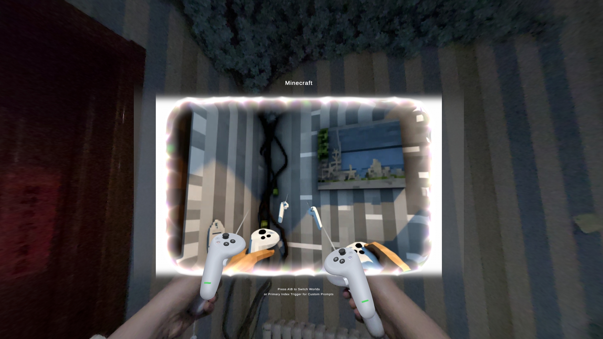
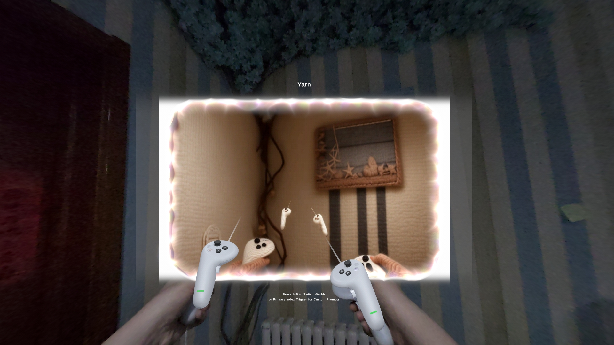
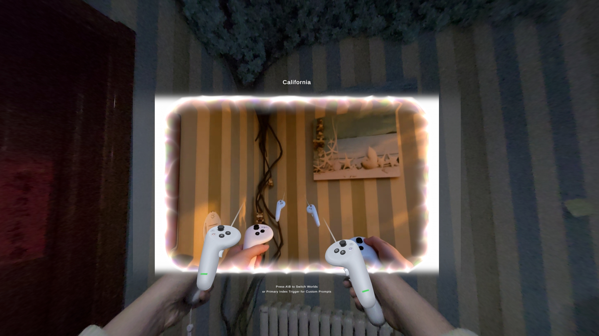

# PICO 首个实时世界转换应用

**基于Decart AI 开发团队的开源项目 Decart-XR ，开发适用于PICO平台的实时世界转换应用**

<p align="center">
  <a href="https://discord.gg/decart">🗣️ Decart AI 的 Discord</a> •
  <a href="https://decart.ai">🌐 Decart.ai 官网</a> •
  <a href="https://platform.decart.ai">⚡ API 平台</a> •
  <a href="https://space.bilibili.com/100714280?spm_id_from=333.1007.0.0">📧 Bilibili 主页联系</a>
</p>

<p align="center">
  
  
</p>

<p align="center">
  
  
  
  
</p>

   

## ✨ 特征

- 🎥 **实时摄像头捕捉** - 直接访问PICO 4 Ultra 企业版 视频透视摄像头 - **需要联系PICO官方申请摄像头使用权限**
- 🤖 **双AI模型** - Mirage (61个世界转换) 和 Lucy (15个人体目标转换) 
- 🌐 **WebRTC 流媒体** - 高效 VP8 视频编码，30fps
- 📱 **VR界面** - 带实时预览和处理后的视频显示

## 🚀 快速入门

## 🔬 Decart AI 模型集成

### 先决条件

- **硬件**: PICO 4 Ultra 企业版，OS版本为5.14+
- **Unity**: Unity 6 (6000.0.39f1) ，需要 Android build support
- **网络**: 8+ Mbps 双向互联网连接

### 安装

1. **克隆仓库**

   ```bash
   git clone https://github.com/liuxunfu/DecartXRForPICO.git
   cd DecartXRForPICO/DecartAIForPICO
   ```

2. **在 Unity 中打开**

   - 启动 Unity Hub
   - 从 `DecartAIForPICO/` 文件夹添加项目
   - 使用Unity 6 (6000.0.39f1) 打开项目

3. **安装所需依赖包**

   - 通过 Unity Package Manager 安装依赖包 (参见 [包依赖](#包依赖))
   - 导入本地依赖包 (包含 NativeWebSocket 和 SimpleWebRTC)

4. **配置 Project Settings**

   - 请按照下方 [Unity 项目配置](#unity-项目配置) 操作

5. **加载主场景**

   ```
   DecartXRForPICO/Assets/DecartAIForPICO/Scenes/DecartAI-Main.unity
   ```

6. **为 PICO 构建**

   - 切换平台到 Android (File → Build Profiles → Android → Switch Platform)
   - 配置 PICO 的构建设置
   - 打开Edit → Project Settings → XR Plug-in Management → Project Validation 并解决配置问题
     - Fix All
     - Keystore 和 Key 可以不用处理
     - **如何配置以使用摄像头权限请联系 PICO 官方**
   - 构建APK并安装至头显 (File → Build Profiles → Build)

7. **Decart AI API Key 设置**

   - 去[Decart AI 官网](https://decart.ai/)注册账号并创建API Key
   - 找到场景中挂载 WebRTCConnection 组件的物体，配置Mirage Web Socket 和Lucy Web Socket 字段
   - 在"api_key="和"&"之间填入API Key

8. **运行应用**

   - 在提示时授予摄像头权限 
   - 选择AI模型: 按下 A 键选择 Mirage (世界转换) 或者按下 B 键选择 Lucy (人体目标转换)
   - 选择AI模型后，用A/B键切换提示
   - 实时观看转换效果！

## 📦 包依赖

通过 Unity Package Manager 安装以下依赖包:

### 所需的 Unity 依赖包
- **PICO Unity Integration SDK** - `com.unity.xr.picoxr` - PICO platform support - 本项目已将其加入版本管理，无需额外安装，若需要其他版本请自行参照[PICO官网](https://developer-cn.picoxr.com/resources/#sdk)进行
- **XR Plug-in Management** - `com.unity.xr.management` - XR system management
- **Universal Render Pipeline** - `com.unity.render-pipelines.universal` - URP rendering
- **Input System** - `com.unity.inputsystem` - Modern input handling

### 包含的本地依赖包
- **NativeWebSocket** - `com.endel.nativewebsocket` - WebSocket communication
- **SimpleWebRTC** - `com.firedragongamestudio.simplewebrtc` - WebRTC integration

## ⚙️ Unity 项目配置

### XR Plugin Management 设置

导航至 **Edit → Project Settings → XR Plug-in Management → PICO**:

- ✅ **确保 Stereo Rendering Mode 设置为 Multiview**

### Player Settings

导航至 **Edit → Project Settings → Player → Android Settings**:

#### Graphics Settings
- **Graphics APIs**: **Vulkan** or **OpenGLES3**
- **Color Space**: Linear
- **Rendering Path**: Forward

#### Configuration
- **Scripting Backend**: IL2CPP
- **Api Compatibility Level**: .NET Standard 2.1
- **Target Architectures**: ARM64 ✅ (ARMv7 ❌)

#### Android Permissions
打开 **Publishing Settings → Build**:
- ✅ **勾选Custom Main Manifest**
- 添加自定义权限: `<uses-permission android:name="android.permission.CAMERA" />`

#### Scripting Define Symbols
在 **Other Settings → Script Compilation 部分**:
- 添加WEBRTC_ENABLED

### Build Profiles 
- **Platform**: Android
- **Texture Compression**: ASTC
- **Development Build**: 调试时可使用

## 🏗️ 架构

```
PICO Camera → Unity WebRTC → Decart AI → Processed Video → PICO Display
     ↑              ↑              ↑            ↑              ↑
  Camera API    VP8 Encoding   Style AI    VP8 Decoding    UI Rendering
   Permissions   @30fps/4Mbps  ~50-100ms     Real-time      Real-time
```

### 核心技术

- **[Decart AI](https://mirage.decart.ai/)** - Advanced video-to-video neural networks
- **SimpleWebRTC** - Unity WebRTC integration and video streaming
- **NativeWebSocket** - Cross-platform WebSocket communication
- **PICO Passthrough Camera API** - Native camera access on PICO 4 Ultra Enterprise
- **WebSocket Signaling** - Custom protocol for AI service communication

## 📖 文档

计划中，后续飞书补充

## 🛠️ 开发

### 关键组件

- `WebRTCController.cs` - Main application controller and UI management
- `WebRTCConnection.cs` - Unity WebRTC lifecycle, video streaming, and model selection
- `WebRTCManager.cs` - Core WebRTC logic with dual AI prompt libraries (61 Mirage + 15 Lucy)
- `WebCamTextureManager.cs` - PC camera integration via Unity API
- `PassThroughCameraManager.cs` - PICO camera integration via PICO API
- `XRControllerManager.cs` - XR Input

### 构建配置

```
Platform: Android
Target: PICO 4 Ultra Enterprise
API Level: Minimum 29, Target Automatic
Architecture: ARM64
Scripting Backend: IL2CPP
```

### 性能规格

- **分辨率**: 1280×720 @ 30fps
- **编解码器**: VP8 with adaptive bitrate (1-4 Mbps)
- **延迟**: ~150-200ms end-to-end

## 🔧 故障排除

### 常见问题

**相机不工作?**

- 确保 PICO 4 Ultra Enterprise 和 PICO OS v5.14+ 配合使用
- 联系 PICO 官方申请相机使用权限
- 在 PICO 设置中授予相机权限

**没有 AI 处理效果?**

- 验证 8+ Mbps 互联网连接
- 等待 5-10 秒进行初始处理
- 如果连接失败，请尝试其他网络
- 重新打开应用程序

**性能问题？**

- 使用信号较强的 5GHz WiFi
- 如果过热，请让设备冷却
- 关闭其他带宽密集型应用

## 📦 依赖项和第三方许可证

该项目包含多个开源组件和专有 SDK，衷心感谢以下内容：

### Unity & Rendering 依赖项
- **[PICO XR SDK](https://developer-cn.picoxr.com/resources/#sdk)** - PICO development SDK (PICO License)
- **[Universal Render Pipeline](https://docs.unity3d.com/Packages/com.unity.render-pipelines.universal/)** - URP rendering (Unity License)

### 开源基础组件
- **[SimpleWebRTC](https://github.com/FireDragonGameStudio/SimpleWebRTC)** by [Fire Dragon Game Studio](https://github.com/FireDragonGameStudio) (MIT License)
- **[NativeWebSocket](https://github.com/endel/NativeWebSocket)** by [@endel](https://github.com/endel) (MIT License)
- **[Decart AI](https://platform.decart.ai/)** (Proprietary Service)

### 许可证兼容性
所有开源组件均兼容MIT许可，PICO SDK均根据各自的开发者协议使用。本项目尊重所有原始许可和署名。

**完整的许可证文本和详细的归属可以在此存储库中的各个组件目录中找到。**

## 📜 许可证

该项目在 MIT 许可下可用。

Decart AI 服务有自己的服务条款。PICO 开发需要 PICO 的开发者协议。

## ⚠️ 免责声明

这是一个展示实时人工智能视频处理能力的实验项目。性能可能会因网络条件、设备温度和 AI 服务可用性而异。

人工智能处理服务由 Decart 提供，并受其服务条款和可用性的约束。

## 📞 联系

对于研究合作、问题或技术支持：

**Bilibili主页:** [乐观的小强](https://space.bilibili.com/100714280?spm_id_from=333.1007.0.0)
**Decart AI Discord 社区:** https://discord.gg/decart
**Decart AI 主网站:** https://decart.ai
**Decart AI API 平台:** https://platform.decart.ai

有关此开源项目的一般查询，请使用 GitHub Issues。

---

*专为 ❤️ PICO开发者社区构建。 由 Decart AI 技术提供支持。*
